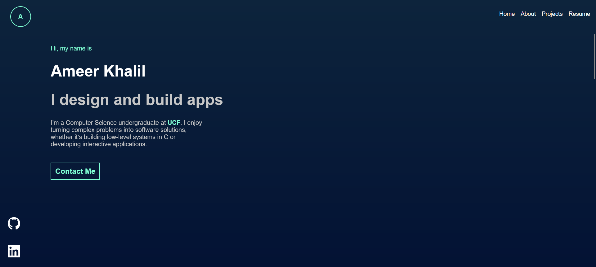

# Portfolio
Personal Website
# KhalilAK Portfolio 🌐

Welcome to my personal portfolio! This website highlights who I am, my projects, skills, and resume.

## 🚀 Live Demo
Check it out here: [https://portfolio-fm0ms6i2p-khalilaks-projects.vercel.app/](https://portfolio-fm0ms6i2p-khalilaks-projects.vercel.app/)

## 🛠️ Built With
- **Frontend:** HTML, CSS, JavaScript
- **Hosting:** Vercel
- **Version Control:** Git & GitHub

## 📂 Features
- **About Me:** Learn more about me and my background
- **Projects:** Showcase of my coding and software projects
- **Skills:** Frontend, backend, and general programming skills
- **Resume:** Downloadable or viewable resume
- **Responsive Design:** Works on desktop, tablet, and mobile

## 📸 Screenshots


## 📌 Installation
To run this project locally:

```bash
git clone https://github.com/KhalilAK/Portfolio.git
cd Portfolio

npm install -g live-server
live-server
